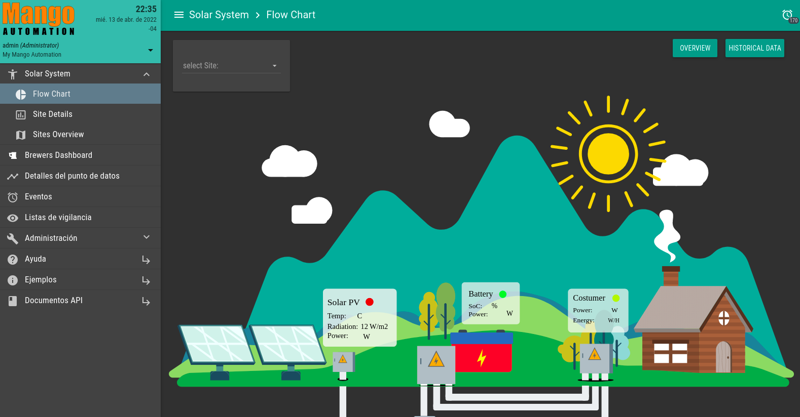
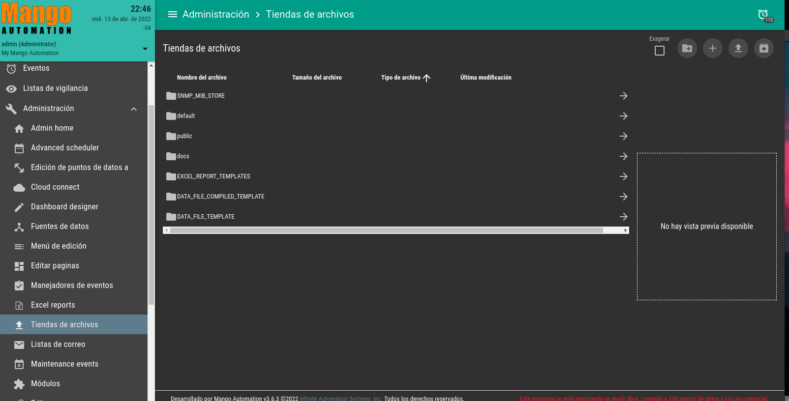
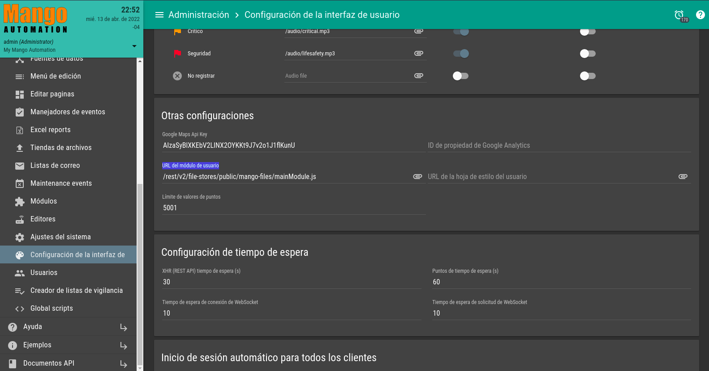
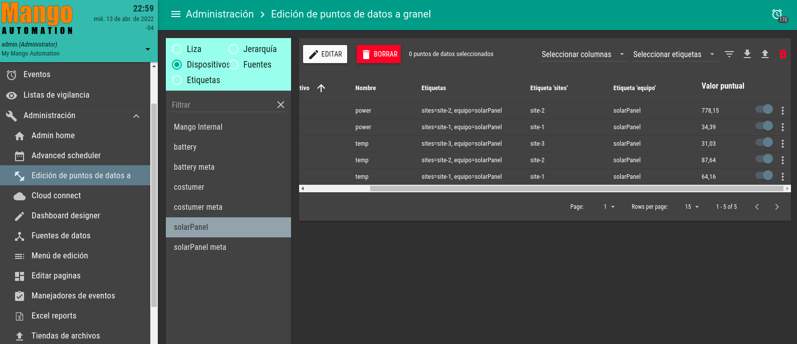

# Mango files

This repository contains the angularJS components for a SCADA solar system Demo in Mango Automation.

## Installation

First you have to be installed Mango Automation software, you can check the installation [here](https://store.mango-os.com/)

After having installed Mango, go to the store files("TIENDA DE ARCHIVOS") and add Mango-files repo to the public directory.

Then go to interfarce configurations("Configuración de la interfaz de usuario") and in the user URL module("URL del módulo de usuario") add the URL of the direction of your mango files.

And thats it you will see a new menu call "Solar System" in the sidebar.

## Getting Started

You can add datapoints in the data point edition menu and see how the interface change. Enjoy!!!

If you want to know how to apply datapoints to a custom mango interface you can review this [blog](https://medium.com/typeiqs/how-to-use-tags-to-organize-data-in-mango-part-i-fb5fa381ec26)

## License

Apache License 2.0
